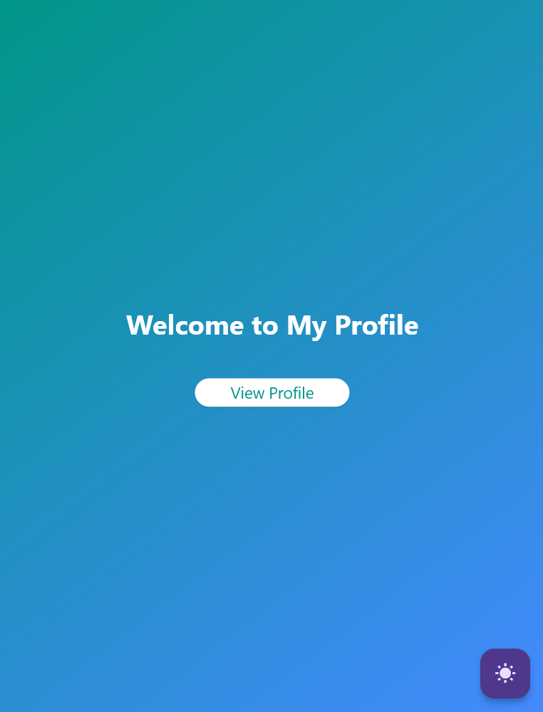
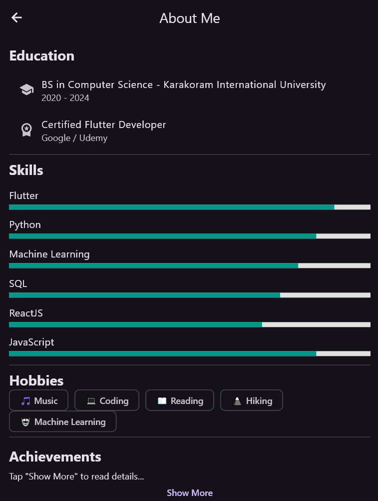

# 🌟 My Profile App – Flutter Project

Welcome to **My Profile App**, a modern, responsive, and interactive Flutter application built to showcase your personal information, skills, and interests — all in a beautifully designed interface.  

This project is designed as part of a **Flutter UI and Navigation Assignment**, demonstrating core Flutter concepts like widgets, layouts, navigation, Material Design, and basic data handling with JSON.

---

## 🎯 Objective

To develop a simple yet feature-rich Flutter app that displays your profile, bio, skills, hobbies, and social media links using Material Design principles — all while applying navigation and layout widgets effectively.

---

## 📱 App Overview

The app consists of **three main screens**:

1. **Welcome Screen**  
   - Displays a gradient background or background image.  
   - Contains a title *“Welcome to My Profile”* and a navigation button *“View Profile”* to access your profile page.  

2. **Profile Screen**  
   - Shows a circular profile image, name, profession, short bio, and contact information.  
   - Contact details (email, phone, location) are displayed in a **Card layout**.  
   - Includes social media icons (LinkedIn, GitHub, Twitter) that open real URLs using the **`url_launcher`** package.  
   - A **Floating Action Button (FAB)** navigates to the “About Me” page.

3. **About Me Page**  
   - Displays information in a **ListView** including Education, Skills (with Chips), and Hobbies.  
   - Provides a **Back button** to return to the Profile Screen.

---

## ✨ Features

✅ **Material Design UI** — built with `MaterialApp` and `Scaffold`  
✅ **Multi-Screen Navigation** — using `Navigator.push()` and `Navigator.pop()`  
✅ **Reusable Widgets** — info cards for contact and social media  
✅ **JSON Data Integration** — loads user data dynamically from `assets/data/user.json`  
✅ **Clickable Links** — phone calls, emails, and social profiles open using `url_launcher`  
✅ **Dark Mode Support (optional)** — easily extendable  
✅ **Responsive Layout** — adapts beautifully across devices  
✅ **Custom Fonts & Colors** — visually consistent, modern, and elegant  

---

## 🧠 Learning Outcomes

By building this app, you’ll understand how to:

- Use core Flutter widgets (`Text`, `Image`, `Column`, `Row`, `Container`, etc.)  
- Apply layout widgets like `Padding`, `Align`, `Card`, `ListView`, and `Wrap`  
- Manage app navigation between multiple screens  
- Load and parse local JSON files for user data  
- Launch external URLs (phone, email, and links)  
- Use Flutter’s Material Design principles effectively  

---

## 📂 Folder Structure

Here’s the official and **final folder structure** for your app:

```

my_profile_app/
│
├── lib/
│   ├── main.dart
│   ├── screens/
│   │   ├── welcome_screen.dart
│   │   ├── profile_screen.dart
│   │   └── about_me_page.dart
│   └── widgets/
│       └── info_card.dart
│
├── assets/
│   ├── images/
│   │   └── profile.jpg
│   └── data/
│       └── user.json
│
└── pubspec.yaml

````

---

## ⚙️ Setup Instructions

Follow these steps to run the project locally:

### 1️⃣ Clone this Repository

```bash
git clone https://github.com/your-username/my_profile_app.git
cd my_profile_app
````

### 2️⃣ Install Dependencies

```bash
flutter pub get
```

### 3️⃣ Run the App

```bash
flutter run
```

> 💡 Make sure you have an emulator or physical device connected.

---

## 🧰 Technologies Used

* **Flutter** — UI Framework
* **Dart** — Programming Language
* **Material Design** — UI Components
* **url_launcher** — To open links, phone, and email
* **JSON (assets/data)** — For user data storage

---

## 📖 How It Works

The app reads user information from a local JSON file (`user.json`) in the `assets/data` directory.
Example JSON structure:

```json
{
  "name": "Tufail Ashraf",
  "profession": "Flutter Developer",
  "bio": "A passionate Flutter developer with a deep love for UI design and clean code.",
  "email": "tufailashraf@example.com",
  "phone": "+92-300-1234567",
  "location": "Gilgit, Pakistan",
  "linkedin": "https://www.linkedin.com/in/tufailashraf",
  "github": "https://github.com/tufailashraf",
  "twitter": "https://twitter.com/tufailashraf",
  "education": "BS in Computer Science - Karakoram International University",
  "skills": ["Flutter", "Dart", "Python", "Machine Learning", "UI Design"],
  "hobbies": ["Coding", "Reading Tech Blogs", "Gaming", "Traveling"]
}
```

The `ProfileScreen` dynamically displays this data, and clicking icons or contact info triggers corresponding actions — like opening LinkedIn or composing an email.

---

## 🧩 Example Interactivity

* Tap **📧 Email** → opens default mail app
* Tap **📞 Phone** → dials the number
* Tap **🔗 LinkedIn / GitHub / Twitter** → opens profile in browser
* Tap **About Me** (FAB) → navigates to a detailed info page
* Tap **Back Button** → returns to Profile Screen

---

## 🌈 Future Enhancements

You can enhance this app further by adding:

* Dark/Light mode toggle
* Animations using `AnimatedContainer` or `Hero`
* BottomNavigationBar to switch between screens
* Local storage (SQLite or Hive) for persistent data
* Firebase authentication for login/profile upload
* Form submission to update user info dynamically

---

## 📸 Screenshots (Example)

| Welcome Screen                        | Profile Screen                        | About Me Page                          |
| ------------------------------------- | ------------------------------------- | -------------------------------------- |
|  |  |  |

*(Add your screenshots here)*

---

## 🧑‍💻 Developer

**Tufail Ashraf**
💼 Flutter Developer | AI Engineer | Frontend Expert
🌐 [LinkedIn](https://www.linkedin.com/in/tufailashraf) • [GitHub](https://github.com/tufailashraf) • [Twitter](https://twitter.com/tufailashraf)

---

## 📜 License

This project is open-source and available under the [MIT License](LICENSE).

---

> 💬 “Design is not just what it looks like and feels like. Design is how it works.” – *Steve Jobs*

---

## ⭐ Show Some Love

If you like this project, give it a ⭐ on GitHub and share your feedback!
Let’s make learning Flutter fun, interactive, and inspiring! 🚀


